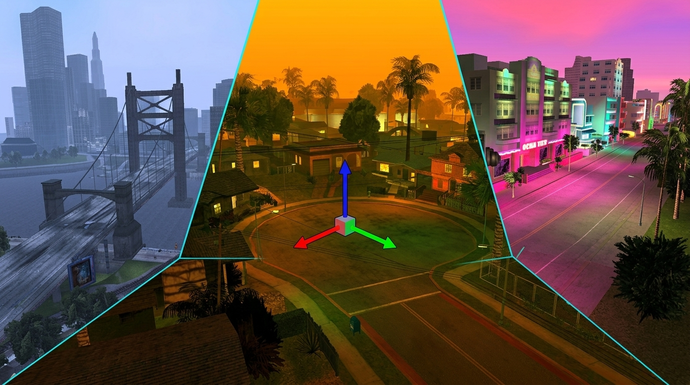

# Ariane

[](https://www.youtube.com/watch?v=jJipK1woGAk)

**[Watch the complete Ariane walkthrough on YouTube →](https://www.youtube.com/watch?v=jJipK1woGAk)**

Ariane is a map viewer and editor for Grand Theft Auto III, Vice City and San Andreas, built on [librw](https://github.com/Southland-FR/librw) and based on aap's euryopa.

[Download the stable editor](https://github.com/Dryxio/ariane/releases/latest) · **[Download Agent Alpha](https://github.com/Dryxio/ariane/releases/tag/v1.40.9-agent-alpha.1)** · [Discord](https://discord.gg/eE9s9H4e24)

## AI agents: CLI + MCP (alpha)

Let an AI agent explore and edit GTA maps through **`arianectl`** or **MCP**: inspect assets, move the camera, capture images, and propose reversible map edits. The agent controls the Ariane editor. Bring your own GTA files; no private server or gtastuff checkout is required.

**Want to use it with your AI? Give your agent this repo and a task.** Use an AI coding agent that can access files and run commands on your computer. It can check your setup and guide you through anything that needs your help.

Copy this into your agent:

> Help me set up the Agent Alpha version of https://github.com/Dryxio/ariane. Read the Agent Alpha installation and CLI/MCP guides linked in the README. Choose the right download for my computer, check what's already installed, and help me install what's missing. Ask where my GTA San Andreas files are. Then launch Ariane, connect through arianectl, take me to Grove Street, and capture an image of the neighborhood from above.

You'll need your own GTA game files. For AI control, use **Agent Alpha**; the stable editor does not include the agent interface.

Available for **Windows x64** and **macOS Apple Silicon**, with real San Andreas CLI/MCP validation. Windows was tested under Windows 11 ARM64/Parallels with x64 emulation. **Linux x64 is experimental**: CI build/tests passed; real-game rendering is untested. [Validation details](https://github.com/Dryxio/ariane/releases/download/v1.40.9-agent-alpha.1/VALIDATION.json).

<details>
<summary>Manual Agent Alpha installation and CLI/MCP setup</summary>

**[Download Agent Alpha 1](https://github.com/Dryxio/ariane/releases/tag/v1.40.9-agent-alpha.1)** → **[Install the ZIP and connect your agent](https://github.com/Dryxio/ariane/blob/v1.40.9-agent-alpha.1/tools/release/AGENT_README.md)** → [CLI/MCP workflow guide](https://github.com/Dryxio/ariane/blob/v1.40.9-agent-alpha.1/tools/agent/README.md)

### Quick example: start the editor, then inspect its camera (macOS/Linux)

After following the installation guide above, launch the **agent-enabled** editor in one terminal:

```sh
cd "/path/to/GTA San Andreas"
"/path/to/agent-bundle/ariane" --agent-socket /tmp/ariane-agent-v1.sock
```

Wait for the map to load. In another terminal, use the CLI installed from the bundle:

```sh
"/path/to/agent-bundle/.venv-agent/bin/arianectl" ping
"/path/to/agent-bundle/.venv-agent/bin/arianectl" camera-context
"/path/to/agent-bundle/.venv-agent/bin/arianectl" capture "$PWD/ariane-view.png"
```

For Windows startup and MCP connection settings, use the [installation guide](https://github.com/Dryxio/ariane/blob/v1.40.9-agent-alpha.1/tools/release/AGENT_README.md). Agent source and documentation are available in the [Agent Alpha release tag](https://github.com/Dryxio/ariane/tree/v1.40.9-agent-alpha.1/tools/agent).

</details>

## Features

### Map editing

- Place, move, rotate and delete map objects, with brush placement for repeated objects
- Select individual objects or whole areas, then translate and rotate them with 3D gizmos
- Enter exact absolute transforms or relative deltas, switch between world and local axes, and copy or paste complete transforms
- Use grid and angle snapping, align objects to the ground, and snap them to nearby surfaces
- Copy, cut and paste selections—including paste in place—with undo and redo support

### Object Browser and prefabs

- Browse objects in list or thumbnail views, with categories, IDE filters, search and favorites
- Preview models in 3D before placing them
- Build reusable prefabs from map selections, then browse, import and place them as a group
- Import custom DFF models and TXD textures

### Saving and iteration

- Save to original game files or keep edits isolated in a modloader/Ariane destination
- Write text or binary IPL data and update IMG archives
- Review changes made since the last save and recover work from automatic backups
- Test GTA III, Vice City and San Andreas maps in game, and hot-reload supported San Andreas changes with `ariane.asi`

### World tools

- Edit San Andreas water and path nodes
- Control time, weather, rendering distance and post-processing while you work
- Inspect collisions, zones, object information and other map data

## Download and usage

Download a current build from [GitHub Releases](https://github.com/Dryxio/ariane/releases/latest), place it in a supported GTA game directory and run it. Ariane automatically detects GTA III, Vice City or San Andreas.

For AI-agent control, download the separate [Agent Alpha bundle](https://github.com/Dryxio/ariane/releases/tag/v1.40.9-agent-alpha.1) and follow its [CLI/MCP installation guide](https://github.com/Dryxio/ariane/blob/v1.40.9-agent-alpha.1/tools/release/AGENT_README.md). The stable editor download above does not include the agent interface.

The universal `ariane.asi` enables Test in Game for GTA III, Vice City and San Andreas, plus Hot Reload for San Andreas. Hot Reload has limitations for streamed binary maps; see the in-app guidance for the current behavior.

The optional integration ZIP on Discord also includes `III.VC.SA.SaveLoader`, which skips intros and loading screens for faster startup across all three games. Both plugins require a working ASI loader.

Get the optional integration ZIP, development updates and support in the [Ariane Discord](https://discord.gg/eE9s9H4e24).

### Release channels

- **master** — the standard and recommended build
- **PE/FLA** — an alternate build for projects that use expanded game limits
- **Agent Alpha** — [agent-enabled editor, CLI and MCP prerelease](https://github.com/Dryxio/ariane/releases/tag/v1.40.9-agent-alpha.1); see [AI agents](#ai-agents-cli--mcp-alpha) above

## Building from source

Ariane requires [Premake 5](https://premake.github.io/) and the
[`ariane` integration branch of librw](https://github.com/Southland-FR/librw/tree/ariane).
For reproducible release builds, use the exact librw commit pinned as
`LIBRW_REF` in `.github/workflows/build-euryopa.yml`. Set `LIBRW` to that librw
worktree before generating the project.

### Linux

Install the compiler and OpenGL/GLFW development packages. On Ubuntu or Debian:

```bash
sudo apt-get install build-essential libgl1-mesa-dev libglfw3-dev
```

Build librw, then Ariane:

```bash
export LIBRW=/path/to/librw-ariane

(cd "$LIBRW" && premake5 gmake2)
CXXFLAGS=-std=c++14 make -C "$LIBRW/build" -j2 \
  config=release_linux-amd64-gl3 librw

premake5 gmake2 --channel=master
make -C build -j2 config=release_linux-amd64-gl3 euryopa
```

Run `bin/linux-amd64-gl3/Release/ariane` with a supported GTA game directory as the current working directory.

### macOS

```bash
export LIBRW=/path/to/librw-ariane
(cd "$LIBRW" && premake5 gmake2 --gfxlib=glfw)

# Apple Silicon
make -C "$LIBRW/build" config=release_macos-arm64-gl3 librw
premake5 gmake2 --channel=master
make -C build config=release_macos-arm64-gl3 euryopa

# Intel
make -C "$LIBRW/build" config=release_macos-amd64-gl3 librw
premake5 gmake2 --channel=master
make -C build config=release_macos-amd64-gl3 euryopa
```

### Windows

Run these commands from a Visual Studio developer shell:

```bat
set LIBRW=C:\path\to\librw-ariane

pushd %LIBRW%
premake5 vs2019
msbuild build\librw.sln /p:Configuration=Release /p:Platform=win-amd64-d3d9 /t:librw /m
popd

premake5 vs2019 --channel=master
msbuild build\librwgta.sln /p:Configuration=Release /p:Platform=win-amd64-d3d9 /t:librwgta;euryopa /m
```

Use `--channel=PE` instead when building the PE/FLA channel.

## License

Because the project depends on LZO (GPL), consider the code in this repository dual-licensed as GPL.

## Credits

- [aap](https://github.com/aap) — original euryopa/librwgta project and librw
